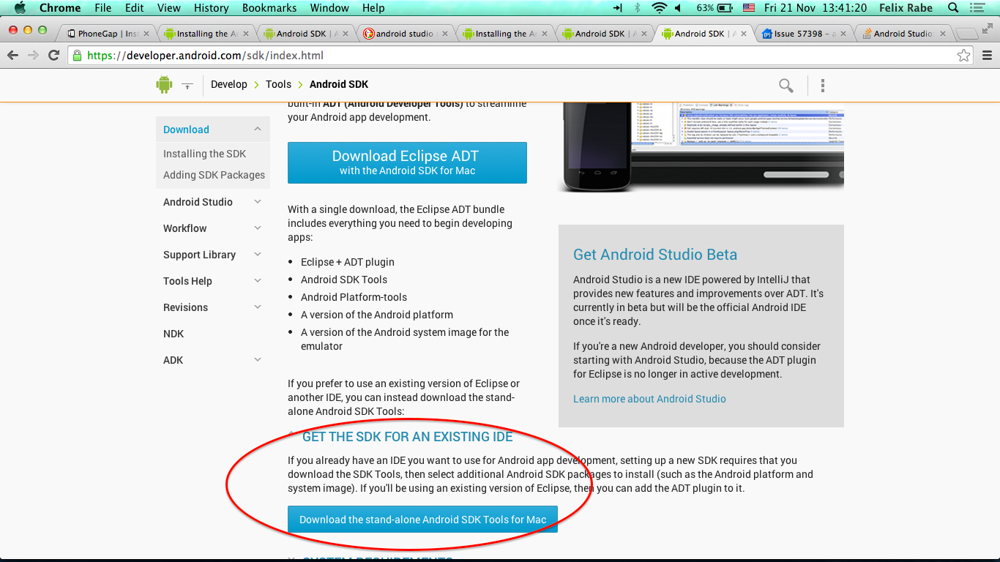
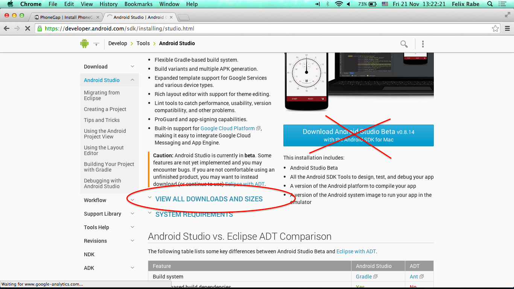

# Hello PhoneGap (on OS X and real device)

# Install the Android development tools

## Java JDK

[The minimum version of the JDK is version 6.](https://developer.android.com/sdk/installing/index.html?pkg=studio)

## Apache Ant

This is used by PhoneGap later on.

http://ant.apache.org/

Download the `bin` ZIP (e.g. `apache-ant-1.9.4-bin.zip`), extract it, and put the `bin` directory on your PATH.

## Android SDK

https://developer.android.com/sdk/index.html

Extract the SDK, then add the `tools` directory to your PATH. Run the `android` command and install Android API 19 (at least).

(Notes: The `SDK Readme.txt` inside the SDK package explains the command, and the API version matches my currently used Android version 4.4.)

## Optional: Android Studio

Warning: This is in beta. But I'm curious whether it works better than Eclipse.

https://developer.android.com/sdk/installing/studio.html

(The download button below eventually worked, but not on the first few tries. Weird.)

# Install NodeJS

http://nodejs.org/

# Install PhoneGap

    npm install -g phonegap  # try with sudo if necessary

# Example application

    phonegap create whatever-app
    cd my-app
    # attach an Android device beforehand
    phonegap --verbose run android --device

(Note: Run `phonegap help` for more information on the command.)

# More resources

## PhoneGap vs Cordova

-   https://duckduckgo.com/?q=phonegap+vs+cordova
-   http://phonegap.com/
-   http://cordova.apache.org/

I decided based on the available information to go with PhoneGap which wraps Cordova.

## Links

-   http://phonegap.com/install/
